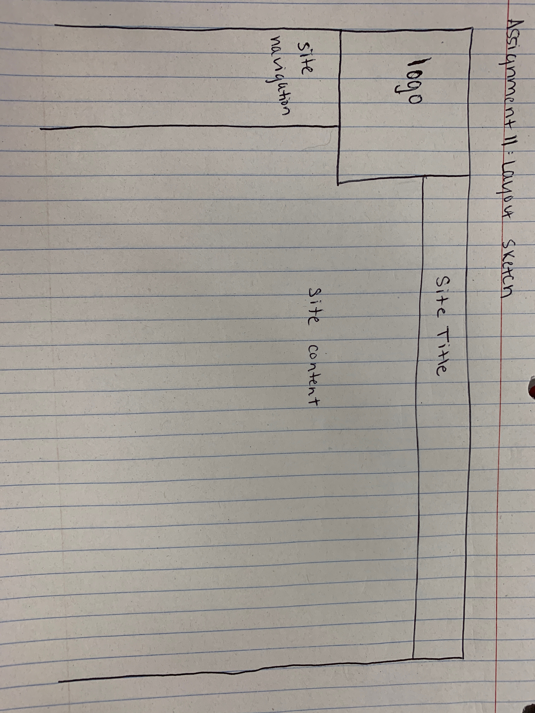

 Padding is the pace put between the content of an element and the element itself which can be made easier to see by adding a border, which will appear as various types of lines, hidden or not at all. Margins can be added to set space between elements on a page.

</a>

For this assignment I started by taking notes on the readings from the course website. After reading, I began working through the assignment steps on Moodle. Once completed, I will upload the assignment to GitHub and then submit the appropriate links on Moodle. 
